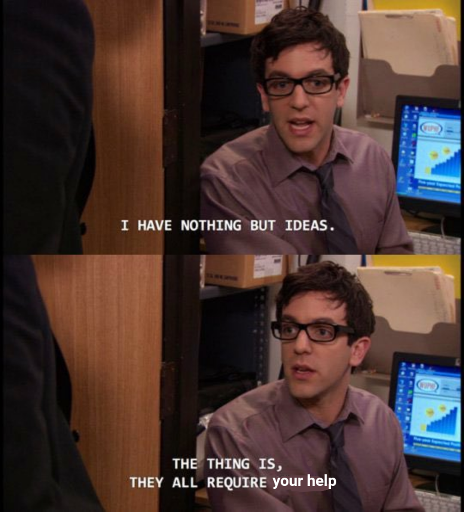

# Potential Ideas I Would Love To Work On

#### Below I have mentioned a few potential ideas identified my me that would be exciting to work on. These are Ideas that I have identified in Graph ML, NLP and the Tech/AI for social good space. If anyone is interested in collaborating, please feel free to reach out to me :) 

1. ## AI/Tech for Social Good

    * ### Efficient methods to screen for Malnutrition in children from Tier 3 communities
        ###### Traditional methods for screening kids in Anganwadis (rural childcare centres) use height and weight to calculate BMI. However BMI, is not an accurate measure of identifying the health of a child. Most of this health records are paper records. Can we come up with a more elegant approach? 
    * ### Computer Vision Based Solution To Enforce Diet Plan Adherence in Anganwadis (Rural child care centres)
        ###### The government issues a diet plan for every Anganwadi to follow to ensure that the child gets a balanced diet. However this is no proper way to ensure adherence to the plan. Can we use some computer vision based solution to ensure that the child care centres stick to their diet plan? 
    * ### Preventing Medical Prescription Errors using some sort of a Knowledge Graph based approach
        ###### Medication errors are common in general practice and in hospitals. Both errors in the act of writing (prescription errors) and prescribing faults due to erroneous medical decisions can result in harm to patients. Can we use some kind of a knowledge graph to identify prescription errors?
    * ### Preventing Cattle Abortions by enabling early diagnosis of diseases like Brucellosis and Leptospirosis
        ###### Can we prevent the loss of potential income to farmers by identifying diseases that cause miscarriage in cattle before it is too late? Brucellosis is hard to identify using external features but Leptospirosis can be identified using external features.
    * ### Classifying Airborne Fungal Spores captured using spore traps to Identify Potential Crop Diseases preemptively
        ###### Can we use Fungal spores and wind blowing patterns to identify large scale damage before its too late?

2. ## NLP
    * ### Multilingual + Code Mixed Visual Question Answering
        ###### Most VQA tasks and models are trained extensively on english datasets. Can we incorporate multilingual and code mixed languages as well? 
    * ### Few shot output sentence generation using VQA models on downstream tasks
    * ### Inferring and Generating empathetic sentences from situational sentences 
    * ### Reduce Stuttering by Using Language Models to Identify Intent of speech and provide sentences for the user to read out
        ###### People that suffer from stuttering have a hard time forming sentences. Many stutterers can read out load fluently. Can we use a language model personalized to a user to identify intent of speech and suggest sentences that they can read aloud? The system should also identify words that the stutterer has a hard time speaking and should replace them with synonyms.
    * ### Identify ROI for movie scenes based on the movie script to enable better allocation of budget
        ###### Can we come up with solutions for better budget allocation for the entertainment industry?

3. ## Graph ML
    * ### Graph Transformer based Retrieval models
        ###### We have vision and language based retrieval systems. Can we build graph based retrieval models for unique tasks?   
    * ### New type of Multimodal models for graph-and-langauge, graph-and-vision modality
        ###### Multimodal Everything!!!